# MolmoMotion test task: trajectory forecasting, ShareRobot transfer, DaS video generation

Code for three experiments (the write-up with figures is a separate report document):

1. Reproduce MolmoMotion's 3D point-trajectory forecast on an example from the authors' benchmark
   (DAVIS `bmx-trees`, PointMotionBench) and score it (ADE / FDE / PWT).
2. Try MolmoMotion on a ShareRobot episode (`bridge#episode_25423`), which has no 3D, no depth and no video,
   and evaluate with explicitly 2D-only measures.
3. Drive Diffusion-as-Shader (DaS) with the predicted trajectory and compare the generated clip with the real
   continuation and with a no-motion control.

Everything was run on Windows 10, RTX 3070 Ti (8 GB VRAM), 16 GB RAM. Several stock code paths do not fit or
crash on such a machine; the workarounds are part of the code (`scripts_local/`) and are described below.
Each part below lists how to run it and, directly under it, the expected results (one clip per part, single run,
single seed; the metrics are in `results/`, small deviations are normal across GPUs / dtypes, DaS is seeded with 42).
The images and videos are rebuilt by `python scripts_local/make_expected_media.py`.

## Setup

Third-party code is cloned next to the scripts (not vendored):

```
git clone https://github.com/allenai/molmo-motion repos/molmo-motion
git clone --recurse-submodules https://github.com/IGL-HKUST/DiffusionAsShader repos/DiffusionAsShader
```

* MolmoMotion environment: Python 3.11, `pip install -r requirements-molmomotion.txt`, then `pip install -e repos/molmo-motion[viz]`.
* DaS environment: Python 3.10, `pip install -r requirements-das.txt` (pins matter: DaS' own unpinned requirements
  resolve to mutually incompatible diffusers / transformers / torchao versions; `deepspeed` is not needed for inference).

Weights and data (plain `curl` was the only reliable way to download them here; check sha256 against the Hugging Face LFS hashes):

```
# MolmoMotion: native checkpoint (needed for predict_trajectory) + config.yaml / tokenizer files from the same repo
curl -L -o checkpoints/MolmoMotion-4B-H3-F30/model.pt https://huggingface.co/allenai/MolmoMotion-4B-H3-F30/resolve/main/model.pt
bash scripts_local/download_das.sh                                   # EXCAI/Diffusion-As-Shader, 25 GB
curl -L -o checkpoints/moge-vitl/model.pt https://huggingface.co/Ruicheng/moge-vitl/resolve/main/model.pt
```

Data: PointMotionBench `davis/tracks/bmx-trees_{2d,3d}.npz` and `davis/davis_captions.json`
(`allenai/PointMotionBench`), DAVIS-2017 trainval 480p frames of `bmx-trees`, ShareRobot
`trajectory/trajectory.json` and the two frames of `trajectory/images/rtx_frames_success_13/49_bridge#episode_25423/`
(`BAAI/ShareRobot`). Scripts expect them under `data/` (see the paths at the top of each script).

## Part 1: MolmoMotion on the authors' DAVIS example

```
python scripts_local/convert_ckpt_bf16.py checkpoints/MolmoMotion-4B-H3-F30/model.pt checkpoints/MolmoMotion-4B-H3-F30-bf16
python scripts_local/part1_infer_and_eval.py     # ~98 min on this GPU
python scripts_local/part1_visualize.py
```

Metrics follow `launch_scripts/eval_pointmotionbench.py`: ADE, FDE, PWT at 1/2/5/10/20 cm, in meters, camera frame at t0,
visible (point, frame) pairs only. `convert_ckpt_bf16.py` streams the fp32 checkpoint into bf16 shards without loading it
whole (`torch.load` crashed on this machine); `lowmem_model.py` builds the model in bf16 and splits it between GPU and CPU.

### Expected results (part 1)

ADE 0.381 m, FDE 0.727 m, PWT 8.6 % (`results/part1_metrics.json`). The run is deterministic (a second run reproduces the
prediction bit for bit).

**Comparison with the authors' released prediction** for the same clip (`examples/data/predictions_h3.jsonl`, score it with
`python scripts_local/eval_cached_predictions.py`): ADE 0.281 m, FDE 0.546 m, PWT 11.8 %, i.e. better than ours; the two
predictions differ by 11 cm on average. The generated texts have the same structure (1021 numbers each) but differ from the first
coordinate on (120 vs 121, 305 vs 307) and drift apart along the sequence (mean difference of the quantized values: 1.4 over the
first 40 numbers, 62 over the last 40), which points to numerical noise (GPU, kernels, bf16 accumulation) amplified by
autoregressive decoding rather than to a bug. Consequence: single-clip numbers depend on the hardware and should not be read as
model quality (`results/part1_vs_authors_prediction.json`, `results/multi_example_metrics.json`). Several clips are run in one
process with `scripts_local/run_examples.py`.

**Confirming the noise hypothesis** (`scripts_local/diag_teacher_forcing.py`): the authors' released generated text is appended
to our prompt and scored in a single teacher-forced forward pass, so every position is compared under identical conditioning
instead of letting earlier autoregressive mistakes compound. On `bmx-trees`, `car-turn` and `flamingo` alike, our argmax token
matches theirs **96.7 % of the time**, and at every mismatch the logit gap between our top token and theirs is tiny (median
0.03 nats, max 0.32) — the kind of margin bf16 rounding differences can flip. Re-running the same test with the authors' own
JPEG frames, the original DAVIS frames, and frames re-decoded from an intermediate mp4 shifts which handful of positions
mismatch but not the overall picture (`results/noise_diagnosis.json`). `flamingo` — the clip where the model is most confident
— has our metrics essentially equal to the authors' (ADE 0.094 vs 0.093 m); `car-turn`, the least confident, has the largest
gap. This is consistent with genuine floating-point noise (different GPU / kernels / the CPU-offloaded bf16 path here vs. the
authors' presumably all-GPU setup) being amplified frame by frame during greedy autoregressive decoding, not a bug in the
inputs. `scripts_local/extra_metrics.py` adds normalized ADE/FDE, an in-tolerance-fraction, Fréchet distance, DTW, direction
cosine and speed ratio for the same clips, ours vs. the authors' prediction (`results/extra_metrics.json`); by direction cosine
both predictions get the heading right (0.93-0.99) even where the magnitude/timing has drifted.

**One more noise check** (`--force-math-attn` in `diag_teacher_forcing.py`): forcing PyTorch's exact, non-fused "math" SDPA
kernel for the LLM's attention (instead of letting it auto-pick flash/efficient/cuDNN) reran the same teacher-forcing test on
all 3 clips. Match rate stayed in the same 95-97 % band with no consistent direction — bmx-trees about the same (96.5 % vs.
96.7 %), car-turn slightly better (96.9 %), flamingo slightly worse (95.6 %) — which is what genuine hardware/kernel
floating-point noise looks like (a real bug would plausibly point the same way on every clip), not a single fixable kernel
choice (`results/noise_diagnosis.json`).

Input: frame t0 with the 8 query points on the rider (action: "A BMX rider rides through the trees").

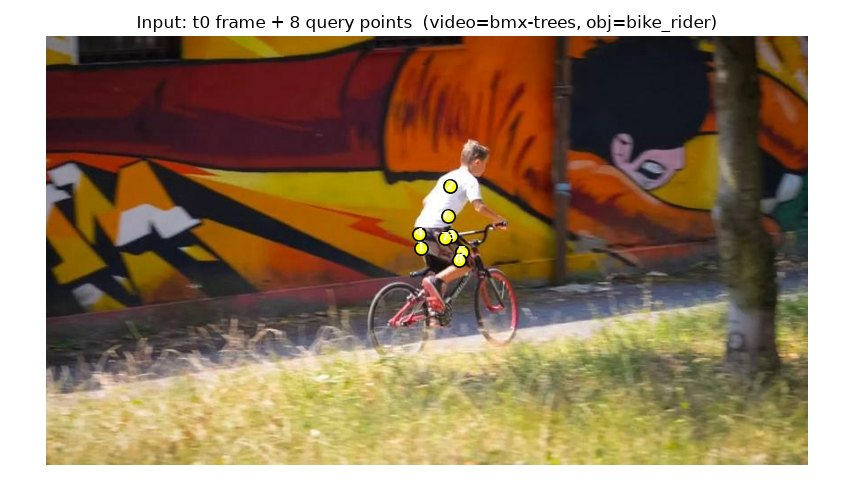

Predicted (magenta) vs real (green, dashed) 3D tracks of the same points, both projected into the t0 camera (canvas
extended because the rider leaves the t0 field of view). Expected: same direction and speed, the prediction covers ~3.1 m
of the real ~3.6 m in 30 frames.

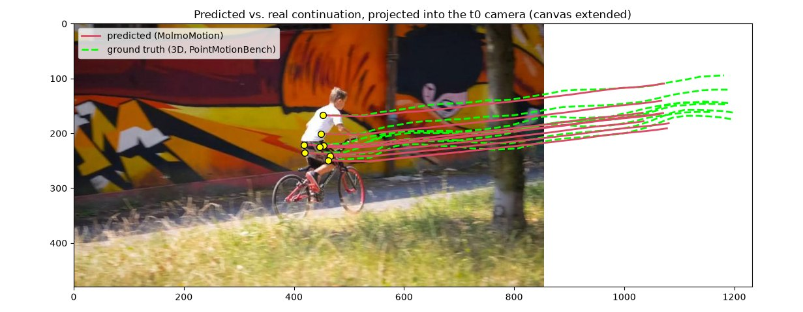

The trails growing over the 30 predicted frames (click for the mp4):

[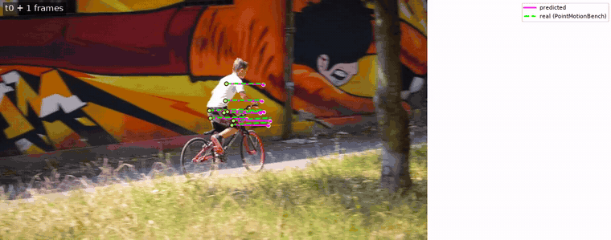](docs/expected/part1_prediction_vs_real.mp4)

Real future frames t0+1 / +10 / +20 / +30 (green: real 2D track in that frame, magenta x: prediction projected into the t0
camera). The camera follows the rider, so the prediction leaves the frame while the real rider stays in the centre; this is why
the metrics are computed in 3D, not on these projections.

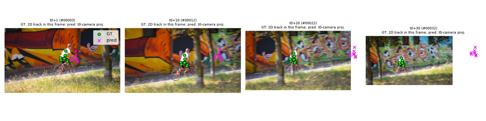

## Part 2: ShareRobot

```
python scripts_local/part2_build_inputs.py       # metric depth (Depth-Anything-V2 indoor), assumed 69.4 deg FOV, 8 query points, replicated history
python scripts_local/part2_infer_and_eval.py     # ~61 min
python scripts_local/part2_visualize.py
```

ShareRobot's `trajectory` split has two frames per episode and 2D end-effector waypoints only, so the 3D input is estimated
and the evaluation is coarse 2D path agreement (definitions in the docstrings).

### Expected results (part 2)

The model predicts zero motion for a replicated single-frame history; the 2D path metrics are then a "does not move"
baseline (`results/part2_metrics.json`).

**With real (non-replicated) history**: the H3 checkpoint needs 3 history frames, so the zero-motion result above could be an
artifact of feeding it 3 copies of the same frame instead of genuine motion. `MolmoMotion-4B-H1-F32` needs only 1 history
frame, so it can be run on the single real ShareRobot frame directly (`scripts_local/run_examples.py --ckpt
checkpoints/MolmoMotion-4B-H1-F32 --future 32 --out outputs/h1 --example-dirs data/sharerobot_example`, ~58 min, scored with
`scripts_local/part2_score_h1.py`). It now predicts real motion (net displacement ~169 px, 3D path length 0.44 m for the
anchor point — not zero), which confirms the zero-motion result in part 2 above is specifically a replicated-history artifact,
not the model failing outright on ShareRobot. The direction is wrong, though (`direction_cosine_similarity = -0.62`, i.e.
closer to opposite than to the annotated path) and the path-agreement numbers stay close to the H3 baseline
(`results/part2_h1_metrics.json`) — with only one frame of history the model has no way to tell which direction the gripper
is already moving in, so it is essentially guessing.

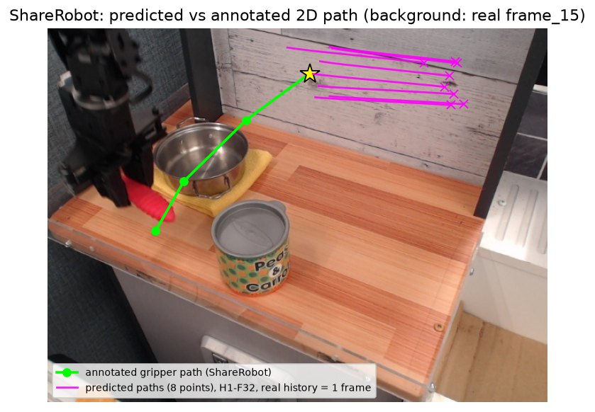

**With real, non-replicated, 3-frame history** (`scripts_local/part2b_build_real_history.py`,
`results/part2_direction_investigation.json`): H1-F32's 1-frame history genuinely cannot carry a direction signal, so this
tests the H3 checkpoint (3 history frames, its native setting) on a ShareRobot episode that actually has enough real frames
for it — `BAAI/ShareRobot`'s `trajectory`/`affordance` splits ship only 2 frames/episode (already exhausted above), but its
`planning` split has real `frame_0..frame_N` sequences; they are packed in a ~510 GB split tar.gz archive, which does not
need to be downloaded whole — streaming it (`curl ... | gzip -dc | tar -x <specific member paths>`, stopped once found) and
picking an episode that happens to sit in the first few MB extracts the handful of frames needed with no meaningful disk or
bandwidth cost. Used episode `49_bridge#episode_4263` (action: "move the pan towards the right side of the yellow knife"),
frames 15/20/25 as history (t-2/t-1/t0) and frame 29 as a short real continuation to check direction against; the query
point is the arm/gripper's 2D position, tracked automatically per frame (centroid of near-black pixels in a fixed ROI) —
coarse (lands near the wrist joint, not a specific fingertip pixel) but consistent, and genuinely moving (229 → 295 → 301 px
across the 3 history frames, matching the episode's real rightward motion). First attempt used an independent monocular
depth estimate per history frame, which was not temporally consistent (1.11 m → 0.65 m → 0.30 m, an unphysical ~0.8 m jump
in a fraction of a second) and swamped the real lateral motion with noise — the model predicted zero motion again, this
time plausibly because the 3D input didn't look physically real rather than because the history was duplicated. Reusing a
single t0 depth map for all 3 history frames (holding depth temporally consistent while keeping each frame's real tracked
2D position) fixed that: the model now predicts **genuine, non-zero motion** (3D path length 0.39 m), but in a direction
close to **opposite** both the real near-future continuation (cosine -0.60) and the history's own direction it was just
given (cosine -0.97, i.e. it moved backwards relative to its own input velocity). Across all 3 independently-constructed
non-duplicated-history attempts (H1-F32's single real frame, H3 with noisy depth, H3 with consistent depth), direction
comes out wrong every time it is not exactly zero — which rules out duplicated history and noisy depth as the (sole)
explanations and points at a genuine limitation of applying MolmoMotion (trained on outdoor/tracked-object footage such as
DAVIS) to tabletop robot manipulation with invented camera intrinsics and an unfamiliar action-conditioning style.

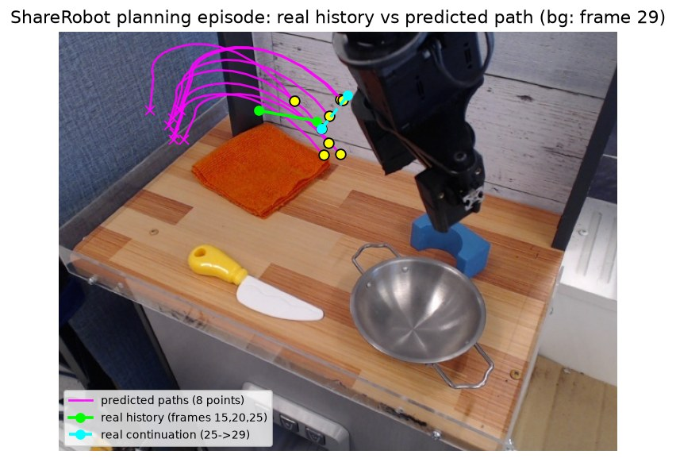

Input frame ("reach for the spoon") with the 8 query points on the gripper (star = the annotated start point).

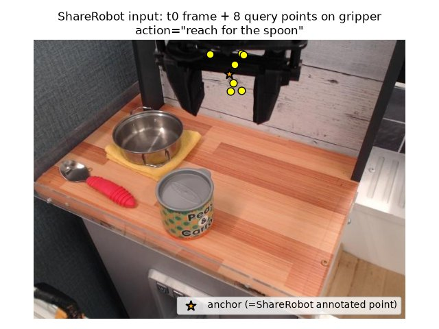

Annotated 2D gripper path (green). Expected: the predicted trajectory collapses to the start point (the predicted path is
not visible), and the 2D metrics equal the baseline (mean 199 px, 25 % of the image diagonal).

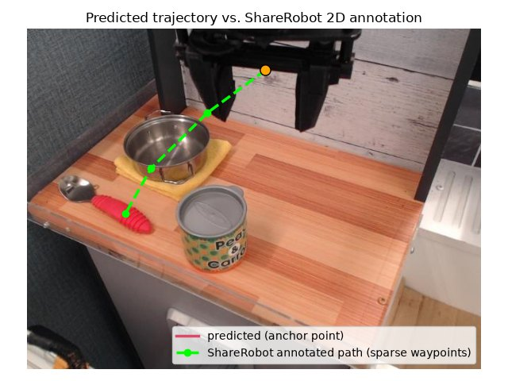

The only real future frame (frame_15): the gripper has moved towards the spoon.

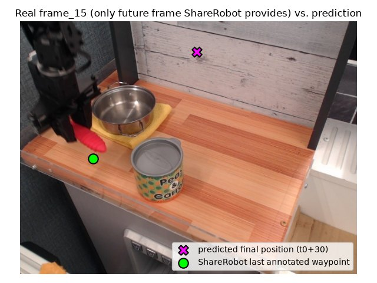

## Part 3: DaS driven by the MolmoMotion prediction

Run inside the DaS environment, from `repos/DiffusionAsShader`:

```
# 1) re-encode the DaS weights to bf16 pieces without mmap (safetensors reads crashed here), then rename the transformer pieces
#    to diffusion_pytorch_model-XXXXX-of-00014.bin and write diffusion_pytorch_model.bin.index.json
python ../../scripts_local/convert_safetensors_bf16.py ../../checkpoints/Diffusion-As-Shader/text_encoder  ../../checkpoints/Diffusion-As-Shader-bf16/text_encoder
python ../../scripts_local/convert_safetensors_bf16.py ../../checkpoints/Diffusion-As-Shader/transformer ../../checkpoints/Diffusion-As-Shader-bf16/transformer
# 2) tracking video from the predicted trajectory (add --static for the no-motion control)
python ../../scripts_local/part3_build_tracking_video.py --t0-image ../../outputs/part1/t0_frame.jpg \
   --pred-npz ../../outputs/part1/pred_and_gt.npz --out ../../outputs/part3/tracking_video.mp4 --device cuda
# 3) prompt encoding (T5 in its own process), then generation
python ../../scripts_local/part3_run_das_lowvram.py --stage encode --image ../../outputs/part3/t0_480x720.png \
   --tracking_video ../../outputs/part3/tracking_video.mp4 --prompt "A BMX rider rides through the trees"
python ../../scripts_local/part3_run_das_lowvram.py --stage generate --block_offload --height 480 --width 720 \
   --num_inference_steps 10 --guidance_scale 1.0 --image ../../outputs/part3/t0_480x720.png \
   --tracking_video ../../outputs/part3/tracking_video.mp4 --prompt "A BMX rider rides through the trees" \
   --output ../../outputs/part3/generated_tracked.mp4
python ../../scripts_local/part3_analyze.py      # metrics + figures (run from the repo root, in the MolmoMotion environment)
```

What it takes to fit 8 GB VRAM / 16 GB RAM (all in `part3_run_das_lowvram.py`):

* the DaS transformer (with the tracking branch) is 17.4 GB in bf16, more than the machine's RAM; it is loaded piece by
  piece as NF4 (bitsandbytes) straight onto the GPU (diffusers' quantized `from_pretrained` first merges all shards in RAM);
* DaS' `__init__` materialises 18 extra blocks in fp32 on the CPU (~16 GB): they are created on the meta device instead;
* T5 runs in a separate process, split between GPU and CPU; only the prompt embeddings are kept;
* `--block_offload` keeps the DiT blocks in host RAM and moves one block at a time to the GPU: a denoising step takes ~27 s;
  with all weights on the GPU (7.8 of 8 GB used) the first step did not finish in 17 minutes;
* `torch.compile` is unwrapped (no Triton on Windows); the resolution cannot be changed (diffusers 0.32 refuses it for this model).

Other files: `part3_diag_load.py`, `gpu_alloc_test.py`, `ram_selftest.py` are the small diagnostics used while debugging the above.

### Expected results (part 3)

480x720, 49 frames, 8 fps, NF4, 10 steps, CFG off, ~330 s and ~5.5 GB peak VRAM per clip. The rider follows the commanded
trajectory (slope 6.4 vs 9.5 px/frame, r = 0.85) and is gone by frame ~24; image quality degrades after ~12 frames
(`results/part3_metrics.json`).

Rows: real continuation, tracking video built from the prediction, DaS with the MolmoMotion trajectory, DaS with a static
(no-motion) tracking video; columns: frames 0 / 12 / 24 / 36 / 48. In the static control the rider stays in place while the
background dissolves.

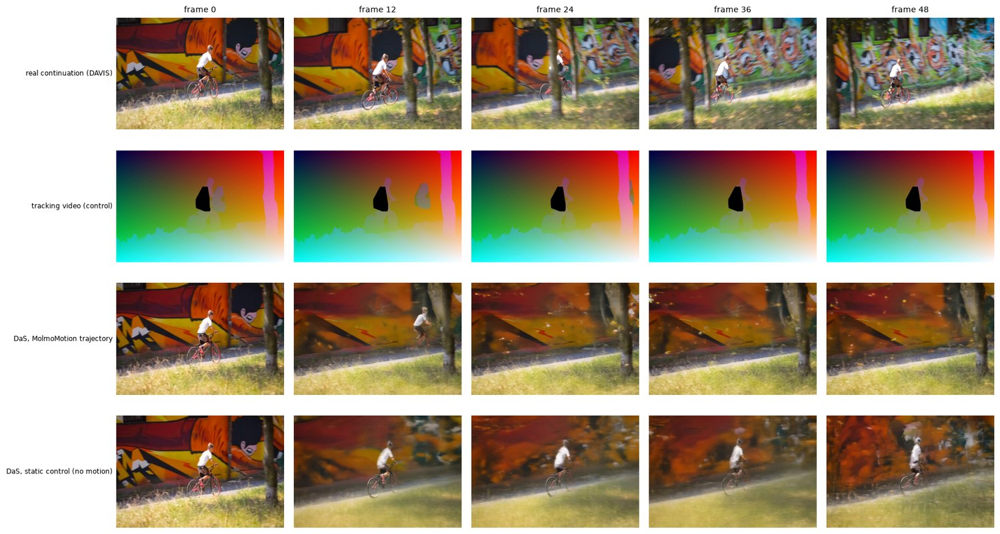

The same four panels as an animation (click for the mp4):

[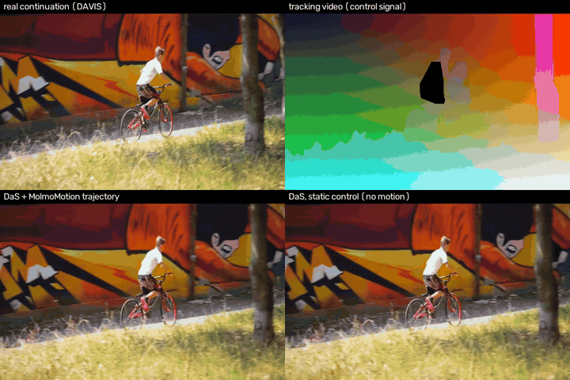](docs/expected/part3_comparison_2x2.mp4)

DaS with the MolmoMotion trajectory:

[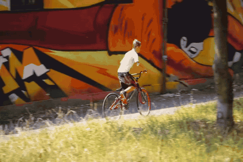](docs/expected/part3_das_trajectory.mp4)

DaS with the no-motion control:

[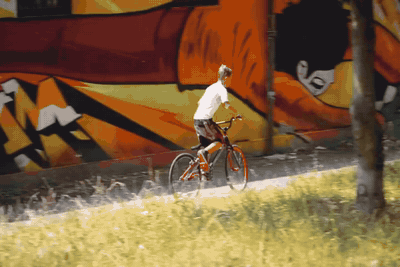](docs/expected/part3_das_static_control.mp4)

The control signal (tracking video) built from the prediction:

[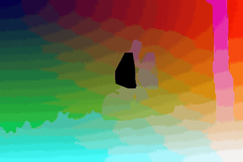](docs/expected/part3_tracking_video.mp4)

**Ablations** (`scripts_local/part3b_analyze.py`, `results/part3_ablations.json`): `part3_build_tracking_video.py` now starts
every tracking video at frame 0 with zero displacement by default (pass `--keep-start-offset` for the old behaviour), and
`--per-point` replaces the single averaged 2D shift with an inverse-distance-weighted field of the 8 points' individual
displacements — on this clip the two motion fields are nearly identical (Pearson r of tracked-vs-commanded dx: 0.912 mean vs.
0.913 per-point) since the 8 query points move together. The real finding is in steps/CFG: **more steps and higher CFG make
this NF4 + block-offloaded setup worse, not better**, and not smoothly — the DPM scheduler (`demo.py`'s default,
`CogVideoXDPMScheduler` with `timestep_spacing="trailing"`) has a sharp cliff rather than a gradual decline.

**Scheduler/step-count diagnosis** (`scripts_local/part3_run_das_lowvram.py --scheduler dpm|ddim`, `results/part3_scheduler_diagnosis.json`):
we first ruled out `use_dynamic_cfg` as a cause — with `guidance_scale=1.0`, `do_classifier_free_guidance` is computed once as
`guidance_scale > 1.0` before the loop and stays `False`, so the per-step dynamic-CFG update is dead code and no second forward
pass ever runs at CFG 1.0 (checked directly in `models/cogvideox_tracking.py`). Sweeping the DPM scheduler by step count instead:

| steps (DPM, CFG 1.0) | 10 | 15 | 18 | 20 | 50 (CFG 6.0) |
|---|---|---|---|---|---|
| correlation with commanded motion (r) | 0.91 | **0.99** | 0.02 | 0.25 | -0.32 |
| RMS error vs. commanded (px) | 71 | **27** | 168 | 165 | 268 |

15 steps is not a plateau before a slow decline — it is the *best* result we got, better than the 10-step default used for the
"expected results" above — and then the very next point we tried, 18 steps, collapses completely (the rider freezes and the
background dissolves). DDIM (the only other scheduler this DaS fork's transformer supports) is mediocre at every step count we
tried (r = 0.30 at 10 steps, 0.29 at 20), so switching scheduler doesn't fix it either. This rules out smooth, monotonic causes
(NF4 error simply compounding over more steps would predict gradual decline, not a cliff between 15 and 18) and points at
something specific to how `CogVideoXDPMScheduler`'s order-2 multistep correction behaves at particular step counts in this
NF4 + block-offload + tracking-conditioned setup; we did not track it down further. **Practical upshot: 15 steps / DPM / CFG
1.0 is a better default than the 10-step one used above** (higher correlation, lower error, visibly sharper output) — the
"expected results" above were generated before this diagnosis and still use 10 steps; rerunning with `--num_inference_steps 15`
is recommended.

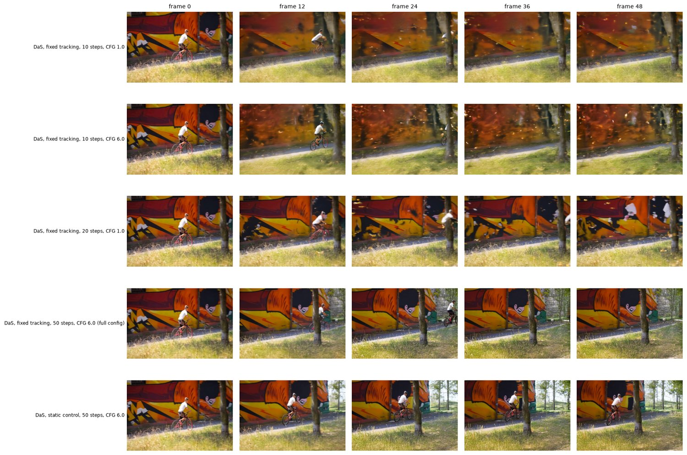

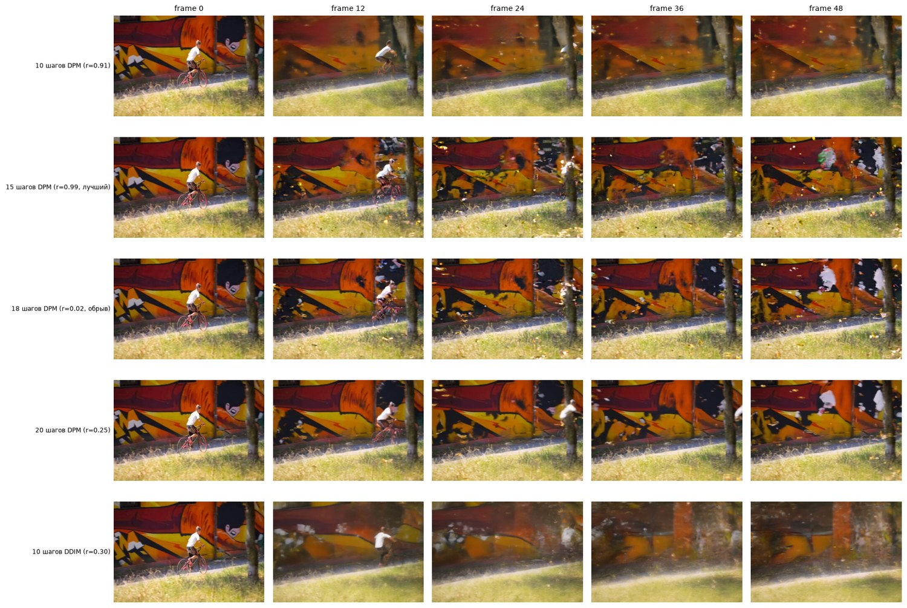

## Known limitations

* One clip per part, one seed.
* The part 3 control is DaS with a static tracking video, not plain CogVideoX-I2V.
* The "expected results" above use 10 steps/CFG 1.0/DPM; a later diagnosis found 15 steps is strictly better and recommended
  instead (see the scheduler/step-count table above) — not yet re-run as the headline result.
* The scheduler cliff between 15 and 18 DPM steps is reported as observed, not explained; DDIM avoids the cliff but is
  mediocre at every step count tried, so it is not a fix either.
* Part 2's zero-motion result is specific to the replicated-history input (see the H1-F32 experiment above); with a single
  real history frame the model predicts motion but not reliably in the right direction, and we could not find a way to give
  it genuine pre-t0 history — ShareRobot's `trajectory`/`affordance` splits ship exactly 2 frames per episode, and the one
  split with real multi-frame sequences (`planning`, `frame_0..frame_N`) ships them only inside a ~510 GB split tar.gz
  archive, far beyond what this machine's disk (19 GB free) can hold. Using ShareRobot's own future waypoints as a stand-in
  for history would leak future information into the input, so we did not do that either.
