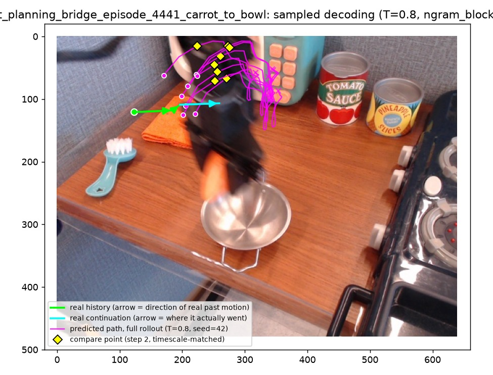
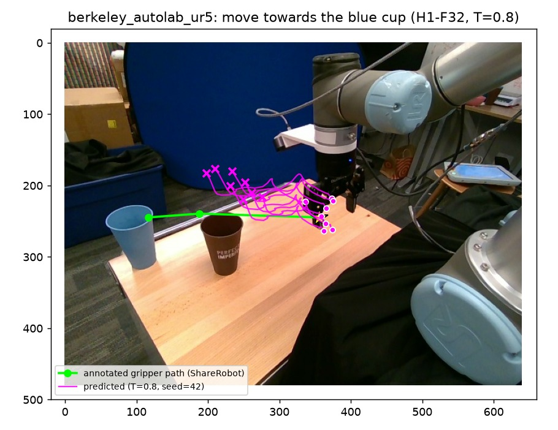
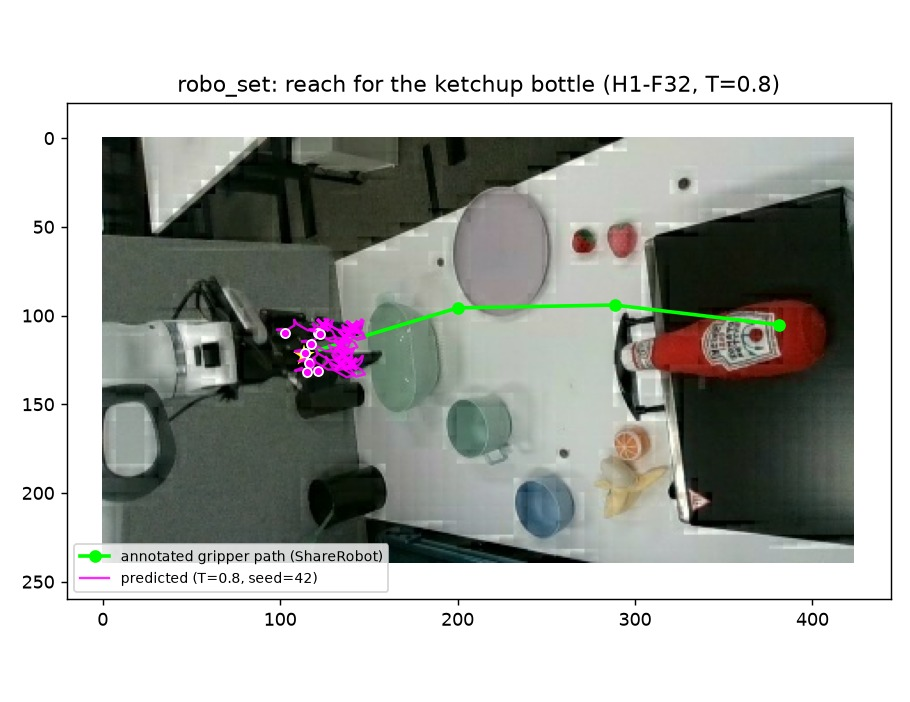
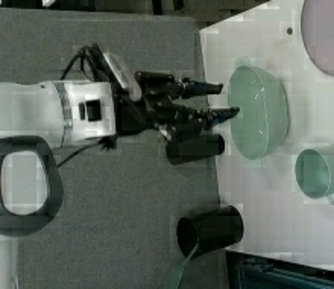
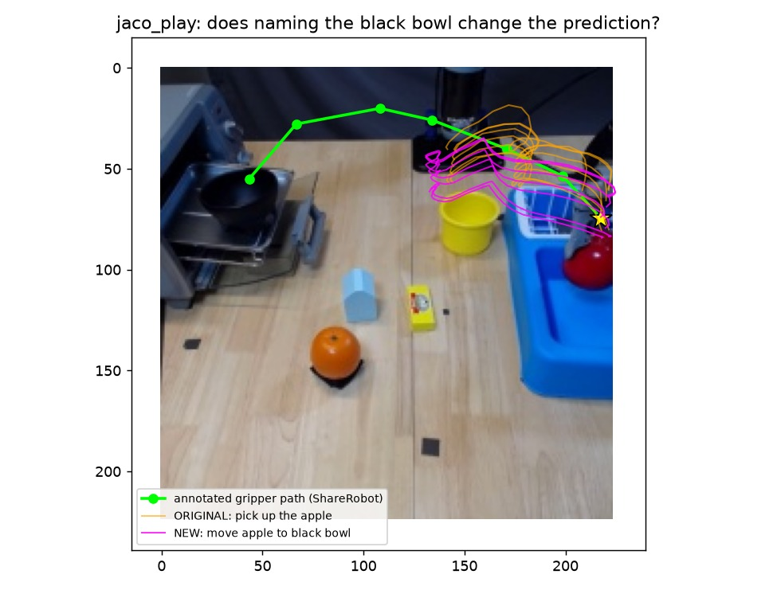

# MolmoMotion test task: trajectory forecasting, ShareRobot transfer, DaS video generation

Code for three experiments (the write-up with figures is a separate report document):

1. Reproduce MolmoMotion's 3D point-trajectory forecast on an example from the authors' benchmark
   (DAVIS `bmx-trees`, PointMotionBench) and score it (ADE / FDE / PWT).
2. Try MolmoMotion on a ShareRobot episode (`bridge#episode_25423`), which has no 3D, no depth and no video,
   and evaluate with explicitly 2D-only measures.
3. Drive Diffusion-as-Shader (DaS) with the predicted trajectory and compare the generated clip with the real
   continuation and with a no-motion control.

Everything was run on Windows 10, RTX 3070 Ti (8 GB VRAM), 16 GB RAM. Several stock code paths do not fit or
crash on such a machine; the workarounds are part of the code (`scripts_local/`) and are described below.
Each part below lists how to run it and, directly under it, the expected results (metrics are in `results/`; small
deviations are normal across GPUs / dtypes; Part 3's DaS generation is seed-sensitive by design — see its section —
so a single run there should be read as one sample, not a guaranteed reproduction).
The images and videos are rebuilt by `python scripts_local/make_expected_media.py`.

## Setup

Third-party code is cloned next to the scripts (not vendored):

```
git clone https://github.com/allenai/molmo-motion repos/molmo-motion
git clone --recurse-submodules https://github.com/IGL-HKUST/DiffusionAsShader repos/DiffusionAsShader
```

* MolmoMotion environment: Python 3.11, `pip install -r requirements-molmomotion.txt`, then `pip install -e repos/molmo-motion[viz]`.
* DaS environment: Python 3.10, `pip install -r requirements-das.txt` (pins matter: DaS' own unpinned requirements
  resolve to mutually incompatible diffusers / transformers / torchao versions; `deepspeed` is not needed for inference).

Weights and data (plain `curl` was the only reliable way to download them here; check sha256 against the Hugging Face LFS hashes):

```
# MolmoMotion: native checkpoint (needed for predict_trajectory) + config.yaml / tokenizer files from the same repo.
# H3-F30 (3-frame history) is used in Part 1 and in Part 2's carrot-to-bowl example; H1-F32 (1-frame history) is
# used in the rest of Part 2. Both need the same small set of config/tokenizer files alongside model.pt.
mkdir -p checkpoints/MolmoMotion-4B-H3-F30 checkpoints/MolmoMotion-4B-H1-F32 checkpoints/moge-vitl
curl -L -o checkpoints/MolmoMotion-4B-H3-F30/model.pt https://huggingface.co/allenai/MolmoMotion-4B-H3-F30/resolve/main/model.pt
curl -L -o checkpoints/MolmoMotion-4B-H1-F32/model.pt https://huggingface.co/allenai/MolmoMotion-4B-H1-F32/resolve/main/model.pt
for ckpt in MolmoMotion-4B-H3-F30 MolmoMotion-4B-H1-F32; do
  for f in added_tokens.json chat_template.jinja config.json config.yaml configuration_molmo_motion.py \
           generation_config.json image_processing_molmo_motion.py merges.txt model.safetensors.index.json \
           modeling_molmo2.py preprocessor_config.json processing_molmo_motion.py processor_config.json \
           special_tokens_map.json tokenizer.json tokenizer_config.json video_preprocessor_config.json \
           video_processing_molmo_motion.py vocab.json; do
    curl -L -f -o "checkpoints/$ckpt/$f" "https://huggingface.co/allenai/$ckpt/resolve/main/$f" || true
    # -f + "|| true": a couple of these files exist for one checkpoint but not the other (e.g.
    # processing_molmo_motion.py is H1-F32-only); a 404 on an optional file is fine, just don't abort the loop.
  done
done
bash scripts_local/download_das.sh                                   # EXCAI/Diffusion-As-Shader, 25 GB (creates its own dirs)
curl -L -o checkpoints/moge-vitl/model.pt https://huggingface.co/Ruicheng/moge-vitl/resolve/main/model.pt
```

Data (PointMotionBench ground truth for Part 1's metrics, DAVIS frames for Part 1's input and Part 3's
real-continuation comparison):

```
mkdir -p data/pointmotionbench/davis/tracks
curl -L -o data/pointmotionbench/davis/tracks/bmx-trees_2d.npz \
  https://huggingface.co/datasets/allenai/PointMotionBench/resolve/main/davis/tracks/bmx-trees_2d.npz
curl -L -o data/pointmotionbench/davis/tracks/bmx-trees_3d.npz \
  https://huggingface.co/datasets/allenai/PointMotionBench/resolve/main/davis/tracks/bmx-trees_3d.npz
curl -L -o /tmp/davis.zip https://data.vision.ee.ethz.ch/csergi/share/davis/DAVIS-2017-trainval-480p.zip
unzip -o /tmp/davis.zip "DAVIS/JPEGImages/480p/bmx-trees/*" -d data/   # -> data/DAVIS/JPEGImages/480p/bmx-trees/*.jpg
```

Scripts expect data under `data/` (see the paths at the top of each script).

## Part 1: MolmoMotion on the authors' DAVIS example

```
python scripts_local/convert_ckpt_bf16.py checkpoints/MolmoMotion-4B-H3-F30/model.pt checkpoints/MolmoMotion-4B-H3-F30-bf16
python scripts_local/part1_infer_and_eval.py     # ~98 min on this GPU
python scripts_local/part1_visualize.py
```

Metrics follow `launch_scripts/eval_pointmotionbench.py`: ADE, FDE, PWT at 1/2/5/10/20 cm, in meters, camera frame at t0,
visible (point, frame) pairs only. `convert_ckpt_bf16.py` streams the fp32 checkpoint into bf16 shards without loading it
whole (`torch.load` crashed on this machine); `lowmem_model.py` builds the model in bf16 and splits it between GPU and CPU.

### Expected results (part 1)

ADE 0.381 m, FDE 0.727 m, PWT 8.6 % (`results/part1_metrics.json`). The run is deterministic (a second run reproduces the
prediction bit for bit).

**Comparison with the authors' released prediction** for the same clip (`examples/data/predictions_h3.jsonl`, score it with
`python scripts_local/eval_cached_predictions.py`): ADE 0.281 m, FDE 0.546 m, PWT 11.8 %, i.e. better than ours; the two
predictions differ by 11 cm on average. The generated texts have the same structure (1021 numbers each) but differ from the first
coordinate on (120 vs 121, 305 vs 307) and drift apart along the sequence (mean difference of the quantized values: 1.4 over the
first 40 numbers, 62 over the last 40), which points to numerical noise (GPU, kernels, bf16 accumulation) amplified by
autoregressive decoding rather than to a bug. Consequence: single-clip numbers depend on the hardware and should not be read as
model quality (`results/part1_vs_authors_prediction.json`, `results/multi_example_metrics.json`). Several clips are run in one
process with `scripts_local/run_examples.py`.

**Confirming the noise hypothesis** (`scripts_local/diag_teacher_forcing.py`): the authors' released generated text is appended
to our prompt and scored in a single teacher-forced forward pass, so every position is compared under identical conditioning
instead of letting earlier autoregressive mistakes compound. On `bmx-trees`, `car-turn` and `flamingo` alike, our argmax token
matches theirs **96.7 % of the time**, and at every mismatch the logit gap between our top token and theirs is tiny (median
0.03 nats, max 0.32) — the kind of margin bf16 rounding differences can flip. Re-running the same test with the authors' own
JPEG frames, the original DAVIS frames, and frames re-decoded from an intermediate mp4 shifts which handful of positions
mismatch but not the overall picture (`results/noise_diagnosis.json`). `flamingo` — the clip where the model is most confident
— has our metrics essentially equal to the authors' (ADE 0.094 vs 0.093 m); `car-turn`, the least confident, has the largest
gap. This is consistent with genuine floating-point noise (different GPU / kernels / the CPU-offloaded bf16 path here vs. the
authors' presumably all-GPU setup) being amplified frame by frame during greedy autoregressive decoding, not a bug in the
inputs. `scripts_local/extra_metrics.py` adds normalized ADE/FDE, an in-tolerance-fraction, Fréchet distance, DTW, direction
cosine and speed ratio for the same clips, ours vs. the authors' prediction (`results/extra_metrics.json`); by direction cosine
both predictions get the heading right (0.93-0.99) even where the magnitude/timing has drifted.

**One more noise check** (`--force-math-attn` in `diag_teacher_forcing.py`): forcing PyTorch's exact, non-fused "math" SDPA
kernel for the LLM's attention (instead of letting it auto-pick flash/efficient/cuDNN) reran the same teacher-forcing test on
all 3 clips. Match rate stayed in the same 95-97 % band with no consistent direction — bmx-trees about the same (96.5 % vs.
96.7 %), car-turn slightly better (96.9 %), flamingo slightly worse (95.6 %) — which is what genuine hardware/kernel
floating-point noise looks like (a real bug would plausibly point the same way on every clip), not a single fixable kernel
choice (`results/noise_diagnosis.json`).

**Two EgoDex clips** (egocentric hand-object manipulation, a different domain from DAVIS's outdoor tracking) confirm the
same picture from a different angle: run with `scripts_local/run_examples.py --examples egodex_clean_surface
egodex_ball_base` (no local ground truth for these, so only compared against the authors' released prediction), our
output differs from theirs by a mean 1.2-1.9 cm — an order of magnitude smaller than the 11-30 cm gap on the DAVIS clips.
This does not contradict the noise explanation (different clips can accumulate different amounts of drift over 30
autoregressive steps depending on how confident/repetitive the model's per-token distribution is), but it does show the
divergence is not a fixed property of our pipeline — it is clip-dependent, consistent with noise amplified unevenly by
autoregression rather than a constant bias.

Input: frame t0 with the 8 query points on the rider (action: "A BMX rider rides through the trees").


Predicted (magenta) vs real (green, dashed) 3D tracks of the same points, both projected into the t0 camera (canvas
extended because the rider leaves the t0 field of view). Expected: same direction and speed, the prediction covers ~3.1 m
of the real ~3.6 m in 30 frames.


The trails growing over the 30 predicted frames (click for the mp4):

[](docs/expected/part1_prediction_vs_real.mp4)

Real future frames t0+1 / +10 / +20 / +30 (green: real 2D track in that frame, magenta x: prediction projected into the t0
camera). The camera follows the rider, so the prediction leaves the frame while the real rider stays in the centre; this is why
the metrics are computed in 3D, not on these projections.


### Numbers behind the "close to the authors'" claims

Every qualitative statement above ("essentially equal", "heading right", "small gap") in one table, per clip, with the
exact source file for each number:

| Metric | Clip | Ours | Authors' released | Source |
|---|---|---|---|---|
| ADE, m | bmx-trees | 0.381 | 0.281 | `results/multi_example_metrics.json` |
| ADE, m | car-turn | 0.506 | 0.262 | `results/multi_example_metrics.json` |
| ADE, m | flamingo | 0.094 | 0.093 | `results/multi_example_metrics.json` |
| FDE, m | bmx-trees | 0.727 | 0.546 | `results/multi_example_metrics.json` |
| FDE, m | car-turn | 1.582 | 0.753 | `results/multi_example_metrics.json` |
| FDE, m | flamingo | 0.145 | 0.145 | `results/multi_example_metrics.json` |
| PWT (mean over 1/2/5/10/20 cm) | bmx-trees | 8.6% | 11.8% | `results/multi_example_metrics.json` |
| PWT | car-turn | 16.8% | 21.2% | `results/multi_example_metrics.json` |
| PWT | flamingo | 42.0% | 43.0% | `results/multi_example_metrics.json` |
| Direction cosine (predicted vs. real heading) | bmx-trees | 0.989 | 0.995 | `results/extra_metrics.json` |
| Direction cosine | car-turn | 0.932 | 0.993 | `results/extra_metrics.json` |
| Direction cosine | flamingo | 0.928 | 0.920 | `results/extra_metrics.json` |
| Mean L2 distance, ours vs. authors' own prediction, m | bmx-trees | 0.114 | — | `results/multi_example_metrics.json` (`our_vs_authors_mean_L2_m`) |
| Mean L2 distance, ours vs. authors' | car-turn | 0.303 | — | `results/multi_example_metrics.json` |
| Mean L2 distance, ours vs. authors' | flamingo | 0.044 | — | `results/multi_example_metrics.json` |
| Mean L2 distance, ours vs. authors' | egodex_clean_surface | 0.019 | — | `results/noise_diagnosis.json` |
| Mean L2 distance, ours vs. authors' | egodex_ball_base | 0.012 | — | `results/noise_diagnosis.json` |
| Teacher-forced token match rate, default attention kernel | bmx-trees / car-turn / flamingo | 96.7% / 96.7% / 96.7% | — | `results/noise_diagnosis.json` (`teacher_forcing_vs_authors_text`) |
| Teacher-forced token match rate, forced math-only attention | bmx-trees / car-turn / flamingo | 96.5% / 96.9% / 95.6% | — | `results/noise_diagnosis.json` |
| Teacher-forcing logit gap at mismatches (median / max over all clips), nats | — | 0.016-0.035 / 0.27-0.37 | — | `results/noise_diagnosis.json` |

("Authors' released" is blank where the authors did not release a prediction to compare against — EgoDex and the
teacher-forcing diagnostics only have an "ours" side by construction.)

## Part 2: ShareRobot

ShareRobot's `trajectory` split has two frames per episode and 2D end-effector waypoints only, so the 3D input is
estimated: `depth-anything/Depth-Anything-V2-Metric-Indoor-Small-hf` (monocular metric depth, via the `transformers`
`depth-estimation` pipeline) gives a per-pixel depth map for the frame, and an assumed 69.4° horizontal FOV converts
the 8 2D query points (the tracked gripper plus 7 points sampled in a small radius around it) into 3D.

We did not validate this depth model's absolute accuracy against ground truth for these episodes (no LiDAR/stereo
reference exists for ShareRobot). What we did check is spatial *consistency*: sampling the depth map independently
at each of the 8 query points (all meant to rigidly track one ~3 cm gripper) gave physically implausible spread —
point-to-point 3D displacements from 0.05 m to 0.77 m, std 0.33 m in depth alone — i.e. the raw per-pixel map is too
noisy at this spatial scale to trust point-by-point. The fix used throughout (`backproject_shared_z` in
`part2b_build_real_history.py`) has all 8 points share a single depth value per frame, sampled once at the anchor
(gripper) point, instead of each independently re-sampling the map. This removes the implausible spread but is a
mitigation for a known inconsistency, not a correction with a known ground-truth error bound.

The evaluation itself is coarse 2D path agreement. `predict_trajectory()` uses pure greedy decoding by default; switching to the
library's own `MultinomialSampler` (temperature=0.8, same weights, no training) gives the model real, non-degenerate
motion to work with instead of collapsing to zero displacement — the question that matters is not whether it moves,
but *where*, and why. One example below (carrot-to-bowl) uses the H3-F30 checkpoint already converted in Part 1; the
other four use H1-F32 (1-frame history — these examples only have a single real frame), converted the same way:

```
python scripts_local/convert_ckpt_bf16.py checkpoints/MolmoMotion-4B-H1-F32/model.pt checkpoints/MolmoMotion-4B-H1-F32-bf16
```

**First case: an episode where the gripper already holds the target object.** The easiest version of the task is one
where the object is already grasped and the job is just to carry it to the one container in the scene —
`episode_4441` ("move towards the bowl" / "drop the carrot into the bowl", gripper holds the carrot from frame 0).
Reproduce:

```
mkdir -p data/sharerobot_real_history9
curl -sL "https://huggingface.co/datasets/BAAI/ShareRobot/resolve/main/planning/images/rt_frames_success.tar.gz.part.aa" \
  | gzip -dc | tar -x -C data/sharerobot_real_history9 --strip-components=9 \
  --wildcards "mnt/hpfs/baaiei/jyShi/ShareRobot/planning/rt_frames_success/rtx_frames_success_14/49_bridge#episode_4441/*"
python scripts_local/part2p_build_carrot_bowl.py
python scripts_local/part2f_sampling_test.py --data-dir data/sharerobot_real_history9_inputs --out-dir outputs/part2p \
  --temperature 0.8 --ngram-block 0 --seed 42 --future-horizon 30 --compare-step 2
```

On the image plane (x, y) the predicted direction matches the real continuation closely (cosine 0.97); the full 3D
cosine is lower (0.11) because the real motion's dominant component is depth (the carrot descending into the bowl),
which the prediction underestimates — see "Known limitations" for the 2D-vs-3D distinction this uncovered more
generally.



**Testing the idea more broadly surfaced a different, more specific pattern than "it just works when already holding
something."** Three more ShareRobot source datasets (different robot platforms/cameras, `trajectory` split, H1-F32
single-frame, same sampled decoding) were tested starting from an *empty* gripper with a reach/pick instruction, to
see whether the model tracks the named target or something else. Reproduce:

```
mkdir -p data/six_examples
curl -sL -o data/six_examples/jaco_play_frame0.png \
  "https://huggingface.co/datasets/BAAI/ShareRobot/resolve/main/trajectory/images/rtx_frames_success_1/27_jaco_play%23episode_104/frame_0.png"
curl -sL -o data/six_examples/berkeley_autolab_ur5_frame0.png \
  "https://huggingface.co/datasets/BAAI/ShareRobot/resolve/main/trajectory/images/rtx_frames_success_20/43_berkeley_autolab_ur5%23episode_506/frame_0.png"
curl -sL -o data/six_examples/robo_set_frame0.png \
  "https://huggingface.co/datasets/BAAI/ShareRobot/resolve/main/trajectory/images/rtx_frames_success_48/62_robo_set%23episode_4845/frame_0.png"
python scripts_local/part2l_build_six_examples.py   # builds inputs for every record in results/six_examples_records.json
                                                      # that has a downloaded frame0 (skips the rest; the 3 above are enough
                                                      # to reproduce this section, the other 3 records cover a wider benchmark)
for name in jaco_play berkeley_autolab_ur5 robo_set; do
  python scripts_local/part2g_sampling_original_h1.py --data-dir data/six_examples_inputs/$name \
    --out-dir outputs/six_examples/$name --temperature 0.8 --seed 42 --tag sampled
done
```

`jaco_play` ("pick up the apple", apple not yet grasped): the model confidently predicts motion (cosine 0.98 vs. the
annotated path) — but towards the nearby yellow bucket, not the apple or the farther black bin:


`berkeley_autolab_ur5` ("move towards the blue cup", blue cup is the named target but farther away): same pattern,
cosine 0.95, predicted path goes to the nearer brown cup instead:



`robo_set` ("reach for the ketchup bottle" — note: *reach for*, nothing to place, gripper is empty) sharpens the
pattern into something more specific than "nearest object": cosine 0.99, but the predicted displacement is tiny
(19.9 px vs. 268.3 px real, 7% of the real distance) and points at a small green bowl sitting immediately next to the
gripper's fingers, not the bottle:




The common thread across all three: the model is not reaching for the named object — it is **placing** something
into the nearest container-shaped region, as if the gripper already held an object, regardless of whether it
actually does (here it is empty and the instruction is to *reach*, not place) or what the instruction names.

**Does naming the correct container explicitly fix it?** ShareRobot's own per-frame annotations give `episode_104`
(the `jaco_play` episode above) a second, later waypoint with a different instruction for the same scene: *"move the
apple towards the black bowl"* — i.e. the dataset's own text for explicitly naming the (correct, farther) target
instead of the generic pick-up phrasing used above. Reproduce (needs the `jaco_play` inputs built in the previous
step):

```
mkdir -p data/six_examples_inputs/jaco_play_blackbowl
cp data/six_examples_inputs/jaco_play/*.pt data/six_examples_inputs/jaco_play/*.jpg data/six_examples_inputs/jaco_play_blackbowl/
python -c "
import json
meta = json.loads(open('data/six_examples_inputs/jaco_play/meta.json').read())
meta['action'] = 'move the apple towards the black bowl'
json.dump(meta, open('data/six_examples_inputs/jaco_play_blackbowl/meta.json', 'w'), indent=2)
"
python scripts_local/part2g_sampling_original_h1.py --data-dir data/six_examples_inputs/jaco_play_blackbowl \
  --out-dir outputs/six_examples/jaco_play_blackbowl --temperature 0.8 --seed 42 --tag sampled
```

Barely changes anything: cosine 0.98 (unchanged within sampling noise) and the predicted displacement actually grows
only slightly, from 43.6% to 48.4% of the real distance. The two predicted paths overlap almost exactly:



So the text of the instruction has, at best, a weak effect — the scene's layout (where a container-shaped object
happens to sit relative to the gripper) dominates over what the instruction actually names.

## Part 3: DaS driven by the MolmoMotion prediction

Run inside the DaS environment, from `repos/DiffusionAsShader`:

```
# 1) re-encode the DaS weights to bf16 pieces without mmap (safetensors reads crashed here), then rename the transformer pieces
#    to diffusion_pytorch_model-XXXXX-of-00014.bin and write diffusion_pytorch_model.bin.index.json
python ../../scripts_local/convert_safetensors_bf16.py ../../checkpoints/Diffusion-As-Shader/text_encoder  ../../checkpoints/Diffusion-As-Shader-bf16/text_encoder
python ../../scripts_local/convert_safetensors_bf16.py ../../checkpoints/Diffusion-As-Shader/transformer ../../checkpoints/Diffusion-As-Shader-bf16/transformer
# 2) tracking video from the predicted trajectory (add --static for the no-motion control)
python ../../scripts_local/part3_build_tracking_video.py --t0-image ../../outputs/part1/t0_frame.jpg \
   --pred-npz ../../outputs/part1/pred_and_gt.npz --out ../../outputs/part3/tracking_video.mp4 --device cuda
cp ../../outputs/part3/tracking_video_motion_curve_px.npy ../../outputs/part3/motion_curve_px.npy  # part3_analyze.py expects this exact name
# 3) prompt encoding (T5 in its own process), then generation
python ../../scripts_local/part3_run_das_lowvram.py --stage encode --image ../../outputs/part3/t0_480x720.png \
   --tracking_video ../../outputs/part3/tracking_video.mp4 --prompt "A BMX rider rides through the trees"
python ../../scripts_local/part3_run_das_lowvram.py --stage generate --block_offload --height 480 --width 720 \
   --num_inference_steps 10 --guidance_scale 1.0 --image ../../outputs/part3/t0_480x720.png \
   --tracking_video ../../outputs/part3/tracking_video.mp4 --prompt "A BMX rider rides through the trees" \
   --output ../../outputs/part3/generated_tracked_480x720_cfg1_10steps_offload.mp4   # part3_analyze.py expects this exact name
# optional: the no-motion control shown in the comparison table/images (part3_analyze.py picks this up automatically if present)
python ../../scripts_local/part3_build_tracking_video.py --t0-image ../../outputs/part1/t0_frame.jpg \
   --pred-npz ../../outputs/part1/pred_and_gt.npz --out ../../outputs/part3/tracking_video_static.mp4 --static --device cuda
python ../../scripts_local/part3_run_das_lowvram.py --stage generate --block_offload --height 480 --width 720 \
   --num_inference_steps 10 --guidance_scale 1.0 --image ../../outputs/part3/t0_480x720.png \
   --tracking_video ../../outputs/part3/tracking_video_static.mp4 --prompt "A BMX rider rides through the trees" \
   --output ../../outputs/part3/generated_static_480x720_cfg1_10steps_offload.mp4
python ../../scripts_local/part3_analyze.py      # metrics + figures (run from the repo root, in the MolmoMotion environment)
```

What it takes to fit 8 GB VRAM / 16 GB RAM (all in `part3_run_das_lowvram.py`):

* the DaS transformer (with the tracking branch) is 17.4 GB in bf16, more than the machine's RAM; it is loaded piece by
  piece as NF4 (bitsandbytes) straight onto the GPU (diffusers' quantized `from_pretrained` first merges all shards in RAM);
* DaS' `__init__` materialises 18 extra blocks in fp32 on the CPU (~16 GB): they are created on the meta device instead;
* T5 runs in a separate process, split between GPU and CPU; only the prompt embeddings are kept;
* `--block_offload` keeps the DiT blocks in host RAM and moves one block at a time to the GPU: a denoising step takes ~27 s;
  with all weights on the GPU (7.8 of 8 GB used) the first step did not finish in 17 minutes;
* `torch.compile` is unwrapped (no Triton on Windows); the resolution cannot be changed (diffusers 0.32 refuses it for this model).

Other files: `part3_diag_load.py`, `gpu_alloc_test.py`, `ram_selftest.py` are the small diagnostics used while debugging the above.

### Expected results (part 3)

480x720, 49 frames, 8 fps, NF4, 10 steps, CFG off, ~330 s and ~5.5 GB peak VRAM per clip (`results/part3_metrics.json`).
Rows: real continuation, tracking video built from the prediction, DaS with the MolmoMotion trajectory, DaS with a static
(no-motion) tracking video; columns: frames 0 / 12 / 24 / 36 / 48. In the static control the rider stays in place while the
background dissolves.


The same four panels as an animation (click for the mp4):

[](docs/expected/part3_comparison_2x2.mp4)

DaS with the MolmoMotion trajectory:

[](docs/expected/part3_das_trajectory.mp4)

DaS with the no-motion control:

[](docs/expected/part3_das_static_control.mp4)

The control signal (tracking video) built from the prediction:

[](docs/expected/part3_tracking_video.mp4)

`part3_build_tracking_video.py` starts every tracking video at frame 0 with zero displacement by default (pass
`--keep-start-offset` for the old behaviour), and `--per-point` replaces the single averaged 2D shift with an
inverse-distance-weighted field of the 8 points' individual displacements — on this clip the two motion fields are
nearly identical (Pearson r of tracked-vs-commanded dx: 0.912 mean vs. 0.913 per-point), since the 8 query points move
together.

### The pipeline does not reliably track the commanded trajectory, and the cause is the scheduler, not configuration or hardware

The result above (r = 0.85 between tracked and commanded x-displacement) is a real run, but not a typical one — the
sections below give the full picture, built from 14 seeds at the same configuration (10 steps, CFG 1.0, DPM scheduler,
`scripts_local/part3_run_das_lowvram.py`).

* **Full 14-seed distribution at the main configuration** (`results/part3_scheduler_diagnosis.json` →
  `FINAL_seed_distribution_at_10steps_cfg1_dpm_n14`): median r = -0.35, mean r = -0.12, only 2/14 (14%) reach r > 0.7.
  A typical run does not track the commanded trajectory.

  | Seed | 42 | 123 | 7 | 999 | 1 | 2 | 3 | 4 | 5 | 6 | 8 | 9 | 10 | 11 |
  |---|---|---|---|---|---|---|---|---|---|---|---|---|---|---|
  | r | 0.912 | -0.695 | -0.353 | 0.118 | -0.558 | -0.425 | -0.402 | 0.356 | -0.353 | -0.454 | -0.587 | -0.129 | 0.085 | 0.832 |

  The r = 0.85-0.91 results shown earlier are real, reproducible properties of their specific seeds — re-running seed
  42 at the same config gives r = 0.991 on a repeat (frames are not bit-identical, mean pixel difference ≈ 4/255 from
  non-deterministic CUDA/NF4-dequantization kernels, but nowhere near enough to explain the swing to negative
  correlation at other seeds) — not a fluke of a single noisy run, but also not what the configuration typically
  produces.

* **Root cause: `CogVideoXDPMScheduler.step()` always adds a `randn` noise term scaled by `mult_noise`, regardless of
  `eta`** — `eta` is accepted as a parameter but never used in the formula (checked directly in the installed
  `scheduling_dpm_cogvideox.py`). This is DaS's default scheduler (`demo.py`'s `timestep_spacing="trailing"`
  configuration) and it is an SDE sampler, not a deterministic ODE one, even nominally at `eta=0`. Patching it to
  zero that noise term (`--deterministic-dpm`) does not fix anything — it makes the same seed/step-count *worse*:

  | | r | Visible frames (rider NCC ≥ 0.5, out of 49) |
  |---|---|---|
  | 18 steps, seed 42, stochastic (default) | 0.017 | 28 |
  | 18 steps, seed 42, noise term zeroed | -0.807 | 3 |

  (`results/part3_scheduler_diagnosis.json` → `seed_variance_followup`) — so the noise is load-bearing to the
  sampling process, not an optional artifact that can simply be switched off.

* **No tuning knob reliably compensates.** Step count (10/15/18/20/50), CFG (1.0/3.0/6.0), and scheduler choice (DDIM
  instead of DPM) were all swept.

  Step count / scheduler at seed 42 (`results/part3_scheduler_diagnosis.json`, top-level entries) — looks like a
  clean optimum at 15 steps:

  | Steps | Scheduler | r | Visible frames /49 | RMS err, px | Slope tracked, px/frame | Slope commanded, px/frame |
  |---|---|---|---|---|---|---|
  | 10 | DPM | 0.912 | 24 | 70.7 | 7.9 | 10.2 |
  | 15 | DPM | 0.986 | 27 | 27.2 | 10.5 | — |
  | 18 | DPM | 0.017 | 28 | 167.8 | -0.1 | — |
  | 20 | DPM | 0.250 | 40 | 165.3 | 2.1 | 10.0 |
  | 50 (CFG 6) | DPM | -0.322 | 49 | 268.4 | -1.7 | 9.9 |
  | 10 | DDIM | 0.299 | 46 | 187.0 | 2.4 | — |
  | 20 | DDIM | 0.291 | 39 | 163.6 | 2.7 | — |

  Same step counts, seed 123 (`results/part3_scheduler_diagnosis.json` → `seed_variance_followup`) — the "15 is
  best, 18+ collapses" pattern does not reproduce:

  | Steps | r (seed 42) | Visible /49 (seed 42) | r (seed 123) | Visible /49 (seed 123) |
  |---|---|---|---|---|
  | 10 | 0.912 | 24 | -0.695 | 49 |
  | 15 | 0.986 | 27 | -0.186 | 48 |
  | 18 | 0.017 | 28 | -0.320 | 48 |

  CFG sweep at seed 123, 10 steps (`results/part3_scheduler_diagnosis.json` → `cfg_sweep_at_seed123_10steps`) — not
  monotonic:

  | CFG | 1.0 | 3.0 | 6.0 |
  |---|---|---|---|
  | r | -0.695 | 0.382 | -0.416 |

  There is also no separate tracking-conditioning-strength parameter to turn down — unlike a ControlNet-style
  `conditioning_scale`, DaS injects its tracking signal through dedicated transformer blocks baked into the model
  (checked directly in `models/cogvideox_tracking.py`), not an adjustable scalar; and `use_dynamic_cfg` is not a
  contributing factor at CFG 1.0 (`do_classifier_free_guidance` is computed once as `guidance_scale > 1.0` before the
  denoising loop and stays `False`, so the per-step dynamic-CFG update is dead code and no second forward pass ever
  runs — checked directly in `models/cogvideox_tracking.py`).

  The practical consequence: single-seed comparisons of steps, CFG, or scheduler on this pipeline (including any one
  run shown in this README) are not statistically meaningful on their own. "Run a few seeds and keep the one that
  tracks well" is a legitimate, cheap strategy (~5 min/seed at 10 steps, ~14% hit rate), but no configuration reliably
  gets a good result in one try.

* **Not caused by this machine's 8 GB VRAM or its NF4 quantization.** The same 14 seed values were re-run on a Kaggle
  notebook with 2x T4 (32 GB combined VRAM), same configuration (10 steps, CFG 1.0, DPM scheduler, same prompt, same
  tracking video), full precision with no 4-bit quantization — weights loaded directly from
  `EXCAI/Diffusion-As-Shader` and split across both GPUs via `accelerate`, no block offload needed since 32 GB
  comfortably fits everything (T4/Turing's efficient-attention kernel does not support `bfloat16` — it errors and
  falls back to a ~56 GB MATH-backend attention matrix that OOMs — so this run used `float16`: still full precision,
  no 4-bit quantization, just not bit-identical to the local bf16-compute-dtype NF4 setup).

  | Seed | 42 | 123 | 7 | 999 | 1 | 2 | 3 | 4 | 5 | 6 | 8 | 9 | 10 | 11 | **median** | **mean** | **r>0.7** |
  |---|---|---|---|---|---|---|---|---|---|---|---|---|---|---|---|---|---|
  | r, NF4 (local, 8 GB) | 0.912 | -0.695 | -0.353 | 0.118 | -0.558 | -0.425 | -0.402 | 0.356 | -0.353 | -0.454 | -0.587 | -0.129 | 0.085 | 0.832 | **-0.35** | **-0.12** | **2/14** |
  | r, no quantization (Kaggle, 32 GB) | -0.225 | -0.226 | -0.223 | -0.456 | 0.214 | -0.799 | 0.596 | -0.300 | -0.152 | 0.793 | 0.992 | -0.838 | -0.350 | -0.568 | **-0.23** | **-0.11** | **2/14** |

  Essentially the same distribution (`results/part3_scheduler_diagnosis.json` for NF4,
  `results/part3_kaggle_fp16_seeds.json` for the no-quantization run). One seed (42) even flips sign between the two
  setups (0.912 vs. -0.225) — consistent with the point above that only the *distribution* across many seeds is
  meaningful here, not any individual seed. Removing quantization entirely, on 4x the VRAM, does not change the
  median correlation or the hit rate: the cause is the scheduler's mandatory stochastic noise interacting with
  commanded motion, not a precision or hardware limitation of this machine. Reproduce: generation script
  `scripts_local/kaggle_das_fp16_sweep.py` (needs a Kaggle account, a GPU T4 x2 notebook, and the small
  control-signal assets — `tracking_video.mp4`, `t0_480x720.png`, `motion_curve_px.npy`, `pred_and_gt.npz` from
  `outputs/part3/`, plus `models/cogvideox_tracking.py` from the DaS repo — uploaded as a Kaggle dataset attached to
  the notebook; it downloads the DaS weights straight from HuggingFace at runtime). Paste it into a new Kaggle
  notebook with that dataset attached and the accelerator set to GPU T4 x2, or push it with the CLI:

  ```
  pip install kaggle
  export KAGGLE_API_TOKEN=<your token, from kaggle.com/settings -> Create New API Token>
  kaggle kernels init -p <dir containing a copy of kaggle_das_fp16_sweep.py>   # then edit kernel-metadata.json:
                                                                                # "enable_gpu": true, "accelerator": "nvidiaTeslaT4", "accelerator_count": 2
  kaggle kernels push -p <dir>
  kaggle kernels status <your-username>/<kernel-slug>
  kaggle kernels output <your-username>/<kernel-slug> -p outputs/part3_kaggle_fp16
  ```

* **The instability is specific to following motion, not a generic property of the pipeline.** Running the *static*
  (no-motion) control at the same seeds that gave wildly different results for the real trajectory:

  | Seed | Visible frames /49 | Rider NCC (mean) | Consecutive-frame SSIM |
  |---|---|---|---|
  | 42 | 49/49 | 0.738 | 0.813 |
  | 123 | 49/49 | 0.762 | 0.784 |
  | 7 | 49/49 | 0.804 | 0.784 |

  (`results/part3_scheduler_diagnosis.json` → `static_control_seed_sweep`) — near-identical, stable outcomes at
  every seed, none of the collapse-into-noise or frozen-rider failure modes seen when a real trajectory is commanded.
  The pipeline is consistent when there is nothing to track; it is specifically the interaction between the
  scheduler's mandatory noise and a *moving* commanded trajectory that is unreliable.


## Known limitations

* One clip per part. Part 3's DaS run does not reliably track the commanded trajectory (median r = -0.35 across 14
  seeds at the best-looking configuration; only 14% of seeds reach r > 0.7) — the root cause is the scheduler's
  mandatory stochastic noise, confirmed not to be fixable by step count, CFG, or scheduler choice, and confirmed not
  to be a hardware/quantization artifact of this machine (an identical 14-seed sweep with no NF4 quantization on 4x
  the VRAM reproduces the same distribution). See "The pipeline does not reliably track the commanded trajectory"
  under Part 3 for the full evidence.
* The part 3 control is DaS with a static tracking video, not plain CogVideoX-I2V.
* Part 2's direction results use greedy decoding's degenerate zero-motion output only as a starting point; all the
  reported findings use sampled decoding (temperature 0.8, one seed) once it gives the model real motion to work
  with, and single-seed results on a generative, temperature>0 decode are not a characterized distribution (see the
  seed-sensitivity lesson from Part 3, which applies in principle here too). The placement-bias pattern itself is
  consistent across 5 independent episodes/source datasets, which is better evidence than any single example, but a
  proper multi-seed sweep per episode was not run for Part 2 the way it was for Part 3.
* The direction-cosine metric used throughout Part 2 is computed on the full 3D vector. On the `episode_4441`
  carrot-to-bowl example this gives a low score (cosine 0.11) despite the predicted path visually tracking the real
  one closely in the image plane — the 2D (x, y)-only cosine is 0.97. The gap is the real motion's depth component
  (the carrot descending into the bowl), which the model's prediction underestimates; a 3D metric penalizes that
  correctly, but it means a low 3D cosine does not always mean "wrong direction" in the way the 2D figures suggest —
  worth checking both when a single episode's result looks surprising.
* This is zero-shot: MolmoMotion is not fine-tuned on ShareRobot or BridgeData V2. Its training mix includes real
  robot manipulation (DROID, ~27K clips, fixed third-person camera) but never Bridge/WidowX/ShareRobot by name
  ([arXiv:2606.18558](https://arxiv.org/abs/2606.18558)), and the paper's own robot-domain transfer result is obtained
  by *finetuning* on DROID, not a reported zero-shot baseline — so a placement-bias prior rather than genuine
  instruction-following on this specific, unseen robot platform is not a surprising gap.
